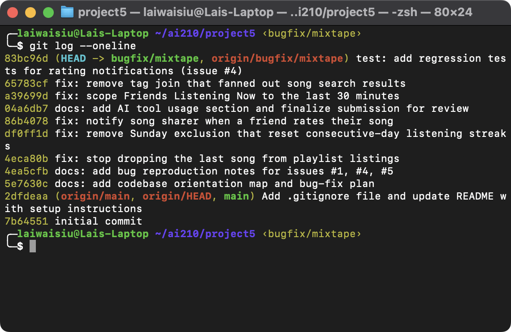

# Project 5: Mixtape Bug Hunt — Submission

**Repository (branch):** https://github.com/wzltmp/ai201-project5-mixtape-starter/tree/bugfix/mixtape

## Commit History



## AI Tool Usage

I used Claude Code throughout, under one governing rule: **the AI generates evidence and counterarguments faster than I could alone, but the judgment calls — what the root cause actually is, what the fix should be — stay with me, verified on real output** (test runs, API responses, direct DB queries), never on the AI's prose alone. The standing question for every claim it made: *did we run it, or did it just say it?*

**Codebase navigation.** The AI gave me a navigation method, not just answers: symptom → route → service → the specific line. Prompts that paid off during orientation:

- *"Explain why `playlist.songs.append(song)` causes a 500."* — surfaced that a plain many-to-many relationship can't populate the association table's required `position`/`added_by` columns; we then confirmed the `IntegrityError` against the live app before writing it into the codebase map.
- *"Trace one request end-to-end: `POST /songs/<id>/listen` from Flask's URL routing through blueprint, service, session, commit, and back to JSON."* — I had traced route→service; the full lifecycle (where the DB session comes from, when the transaction actually commits) is the level below, and it's where the streak bug's single-commit design became clear.
- *"Summarize the known issues in this codebase that are **not** among the five tracked bugs."* — produced a "here's what I'd file next" list: the position-less playlist append 500, the N+1 queries in the feed loops, and notification bodies baking usernames in at write time.

**Debugging.** Two AI-assisted techniques did the heavy lifting, both reusable: the **working/broken sibling diff** (issue #4 — compare `add_to_playlist()`, which notifies, against `rate_song()`, which doesn't, and explain every difference) and the **controlled-clock experiment** (issue #1 — the Sunday branch was unreachable through the live API on a Thursday, so we called `update_listening_streak()` directly with a Sat→Sun sequence plus a Tue→Wed control case).

**What it helped me understand most** wasn't any single bug: it was the difference between a symptom and a mechanism (not "streaks reset" but "a rejected increment falls through to an `else` that actively writes 1"), and that observed behavior can contradict a correct reading of the code — issue #3's duplicate rows exist at the SQL level but are invisible in the API output.

**Where I had to verify things myself, or the AI was wrong or incomplete:**

- **It made a real error:** during a cleanup script it caused a `StaleDataError` by double-deleting an association row (deleting from `playlist_entries` manually, then letting the ORM cascade attempt the same delete). I investigated the traceback and reviewed the corrected cleanup myself rather than accepting its next suggestion blind.
- **It guessed data wrong:** while planning the issue #5 reproduction it asserted the last song in "Late Night Vibes" was "First Light"; the actual `playlist_entries` query said "Free Throws" at position 7. Small, but it set my rule that AI claims about *data* get checked against the DB before they enter this document.
- **Its explanation was incomplete without an experiment:** its account of why issue #3's duplicates are masked rests on a library-behavior claim from memory (legacy `Query` entity-deduplication in SQLAlchemy). We grounded the observable half by experiment — `query.count()` = 3 vs `len(query.all())` = 1 — and I treat the mechanism's naming as something to confirm against SQLAlchemy's docs before citing it in a graded RCA.
- **It would have pointed me wrong on intent:** for issue #2 it cannot know the intended "listening now" window — its suggestion (~30 minutes) is an inference from seed-data comments, delivered as confidently as its verified claims. The project brief's issue description is the authority there; this is the clearest case where trusting a fluent AI default over the actual spec would have produced a wrong fix.

## Milestone 1 — Codebase Map

### How the app is put together

Mixtape is a Flask JSON API with a three-layer structure: **routes** (HTTP), **services** (business logic), **models** (persistence). There is no frontend — every feature is an endpoint returning JSON.

#### `app.py` — application factory

Creates the Flask app, configures SQLite (`mixtape.db` by default, overridable via `DATABASE_URL` / a config dict for tests), and registers four blueprints with URL prefixes: `/songs`, `/playlists`, `/users`, `/feed`. The shared `db = SQLAlchemy()` object lives *here*, and `models.py` imports it back from `app` — a circular arrangement that works under `FLASK_APP=app:create_app flask run` but breaks under `python app.py` (the module gets imported twice, once as `__main__` and once as `app`, producing two different `db` objects). `db.create_all()` runs inside the factory, so tables always exist.

#### `models.py` — 7 models + 3 association tables

All primary keys are UUID strings (`String(36)`), not integers. All timestamp defaults are timezone-aware UTC (`datetime.now(timezone.utc)`) — but SQLite hands them back *naive*, which is why some services defensively re-attach `tzinfo` (see `streak_service.py:64-65`).

| Model | Role | Notable details |
|---|---|---|
| `User` | account + streak state | `listening_streak`, `last_listened_at`; self-referential many-to-many `friends` (symmetric — seed inserts both directions), `lazy="dynamic"` |
| `Song` | a shared track | `shared_by` FK = the user who shared it (drives notifications); `tags` many-to-many, `lazy="subquery"` (always eager-loaded) |
| `Tag` | genre label | unique name |
| `ListeningEvent` | user × song × timestamp | the raw material for both the feed and streaks |
| `Rating` | user's 1–5 score | `UniqueConstraint(user_id, song_id)` — one rating per user per song; re-rating updates in place |
| `Playlist` | collaborative list | songs many-to-many **through `playlist_entries`**, which carries extra columns: `position` (explicit ordering — not insertion order), `added_by`, `added_at`. `position` and `added_by` are `nullable=False` |
| `Notification` | inbox item | `user_id` recipient, free-form `notification_type` string, `read` flag |

Every model has a `to_dict()` serializer; routes return `jsonify(...)` of these dicts.

#### `routes/` — thin HTTP layer

One blueprint per resource. Each route does exactly three things: parse input (query params / JSON body), call **one** service function, and translate errors — services raise `ValueError`, routes catch it and return 400/404 JSON. No business logic lives here. (One small exception: `routes/users.py:get_user` queries the `User` model directly instead of going through a service.)

- `songs.py` — `GET /songs/search?q=`, `GET /songs/<id>`, `POST /songs/<id>/rate`, `POST /songs/<id>/listen`
- `playlists.py` — `POST /playlists/`, `GET /playlists/<id>`, `GET+POST /playlists/<id>/songs`
- `users.py` — `GET /users/<id>`, `GET /users/<id>/streak`, `GET /users/<id>/notifications`, `POST /users/notifications/<id>/read`
- `feed.py` — `GET /feed/<user_id>/listening-now`, `GET /feed/<user_id>/activity`

#### `services/` — all business logic (and all five bugs, per the README)

- `streak_service.py` — `record_listening_event()` creates a `ListeningEvent` then calls `update_listening_streak()`, which compares calendar days between `last_listened_at` and now: same day → no change, consecutive day → +1, gap → reset to 1.
- `feed_service.py` — `get_friends_listening_now()` pulls friends' `ListeningEvent`s newer than a module-level `RECENT_THRESHOLD` (currently 24 h), dedupes to the most recent song per friend. `get_activity_feed()` is the deliberately-unfiltered variant (latest N events regardless of age).
- `search_service.py` — `search_songs()` does a case-insensitive `ILIKE` on title/artist, with an `outerjoin` to `song_tags`.
- `notification_service.py` — `create_notification()` is the shared write path. `add_to_playlist()` both mutates the playlist *and* notifies the song's sharer. `rate_song()` upserts a `Rating`. `get_notifications()` / `mark_as_read()` are the read side.
- `playlist_service.py` — playlist CRUD; `get_playlist_songs()` joins through `playlist_entries` ordered by `position`.

#### `tests/` and `seed_data.py`

Tests use the app factory with in-memory SQLite, so they run against a clean DB without touching `mixtape.db`. **Baseline: 3 of 13 tests fail on the untouched starter** (`test_playlist_returns_all_songs`, `test_playlist_returns_songs_in_order`, `test_streak_increments_on_sunday`) — the suite already encodes the expected behavior for two of the open issues. `seed_data.py` drops and recreates everything: 5 users with friendships centered on nova, 13 songs in a deliberate 0/1/3-tag mix, 3 playlists of 7 songs each, listening events both recent (≤30 min) and old (2 h–14 days), and one sample `song_added_to_playlist` notification showing the correct notification pattern.

### Data flow #1 (featured): friend adds your song to a playlist → you get notified

1. `POST /playlists/<playlist_id>/songs` with `{"song_id", "added_by"}` → `routes/playlists.py:add_song()`
2. → `notification_service.add_to_playlist(playlist_id, song_id, added_by)` — validates that song, adder, and playlist all exist (`ValueError` → 400 if not)
3. → if the song isn't already in the playlist: `playlist.songs.append(song)` + commit
4. → if `song.shared_by != added_by`: `create_notification(user_id=song.shared_by, type="song_added_to_playlist", body="<adder> added your song '<title>' to the playlist '<name>'.")`
5. → the sharer sees it via `GET /users/<their_id>/notifications`

Two things I noticed tracing this **in the running app**, not just on paper:

- **Layering oddity:** the playlist mutation lives in `notification_service`, not `playlist_service`. The service boundary here is "notification-generating actions," not "playlist actions."
- **The happy path doesn't actually survive contact:** step 3 inserts into `playlist_entries` via the plain relationship, which supplies neither `position` nor `added_by` — both `NOT NULL`. A live `POST` returns **500** with `sqlite3.IntegrityError: NOT NULL constraint failed: playlist_entries.position` (commit rolls back, nothing persists). This is *not* one of the five listed issues, but it explains why the seed script inserts playlist entries with raw `playlist_entries.insert().values(...)` instead of the relationship.

### Data flow #2 (brief): listening updates your streak

`POST /songs/<id>/listen` → `routes/songs.py:listen()` → `streak_service.record_listening_event()` → inserts a `ListeningEvent`, then `update_listening_streak(user, now)` compares `now.date()` against `last_listened_at.date()` (re-attaching UTC tzinfo, since SQLite returns naive datetimes) and applies the same-day / consecutive-day / gap rules → single commit covers both the event and the user row.

### Patterns I noticed

- **App factory + blueprints**, with the `db` object owned by `app.py` and imported everywhere else — the source of the `python app.py` double-import trap.
- **Consistent error convention:** services raise `ValueError`, routes translate to 4xx JSON. No other exception types are used, so anything unexpected surfaces as a 500.
- **UUID string PKs and `to_dict()` serializers** on every model; routes never hand-build response dicts.
- **Datetime discipline is asymmetric:** writes are timezone-aware UTC, reads from SQLite are naive; only `streak_service` compensates.
- **Eager vs lazy loading is deliberate:** `Song.tags` and `Playlist.songs` are `lazy="subquery"`; `User.friends` is `lazy="dynamic"` (query object, supports further filtering).

---

## The five issues — first read and plan

Hypotheses formed while reading (to be confirmed by reproduction before any fix, per M2):

| # | Issue | Service | Initial suspicion |
|---|---|---|---|
| 1 | Streak keeps resetting | `streak_service.py` | `update_listening_streak` increments only when `today.weekday() != 6` — a consecutive-day listen that lands on a **Sunday** falls through to the reset branch. The repo's own `test_streak_increments_on_sunday` fails on the starter. |
| 2 | "Friends Listening Now" shows people from yesterday | `feed_service.py` | `RECENT_THRESHOLD = timedelta(hours=24)` — a 24-hour window is "listened in the past day," not "listening now." Seed data pointedly creates events at ≤30 min and at 2 h+. |
| 3 | Same song shows up twice in search | `search_service.py` | The `outerjoin` to `song_tags` fans out one row per tag (verified: 3 raw SQL rows for a 3-tag song). Interestingly the duplicates are currently **masked** — legacy `Query.all()` dedupes entities — so reproduction needs SQL-level evidence. |
| 4 | Notified on playlist-add but not on rating | `notification_service.py` | `add_to_playlist()` calls `create_notification()`; `rate_song()` never does. Missing notification write, same guard needed (don't notify when rating your own song). |
| 5 | Last song in a playlist never shows up | `playlist_service.py` | `get_playlist_songs` returns `songs[:-1]` — the slice unconditionally drops the final element. Two starter tests fail because of it. |

**Plan — first three:** **#5** (playlist off-by-one), **#1** (streak Sunday condition), **#4** (missing rating notification). All three have unambiguous root causes and either already-failing tests (#1, #5) or a trivially reproducible absence (#4). **Stretch:** #2 (feed threshold — needs the issue description to pin the intended window) and #3 (search fan-out — needs care because the symptom is version-masked).

---

## Root Cause Analyses

*(One entry per fixed bug, all five fields complete; each fix is its own `fix:` commit on `bugfix/mixtape`.)*

### Issue #1 — My listening streak keeps resetting

**The issue as reported:** Users' listening streaks reset even when they listen on consecutive days.

**How I reproduced it:** The buggy branch only executes when *today* is a Sunday, so it can't be triggered through the live API on an arbitrary day (I did this milestone on a Thursday) — the app state needed is a `last_listened_at` of yesterday *and* a current date falling on Sunday. I reproduced it by calling `update_listening_streak()` directly with controlled `now` values against an in-memory DB, with a control case to isolate the condition:

```
tue_to_wed: Tue 2026-06-30 streak=1 -> Wed 2026-07-01 streak=2 (expected 2, ok)
sat_to_sun: Sat 2026-06-27 streak=1 -> Sun 2026-06-28 streak=1 (expected 2, BUG)
```

Consecutive weekday listens increment correctly; the identical sequence crossing Saturday→Sunday resets to 1. This matches the "keeps resetting" phrasing — it silently eats the streak once a week. The starter suite already encodes the expectation: `tests/test_streaks.py::test_streak_increments_on_sunday` fails on the untouched repo with `assert 1 == 2`.

**How I found the root cause:** Traced top-down from the action: `POST /songs/<id>/listen` → `routes/songs.py:listen()` → `streak_service.record_listening_event()`, which creates the `ListeningEvent` and delegates to `update_listening_streak(user, now)` — so all streak decisions live in that one function. Read its branches against its own docstring, which states the intended rules plainly (same day → no change; yesterday → +1; otherwise → reset) *with no weekday exception*. The increment branch reads `elif days_since_last == 1 and today.weekday() != 6:` — that second clause appears nowhere in the spec. The confidence moment came from the controlled-clock runs: Tue→Wed increments while Sat→Sun resets, and the *only* condition distinguishing those two inputs is `today.weekday() != 6`. Verified by inspection of the fall-through: when the clause is false, execution lands in the `else`, which is the reset-to-1 branch.

**The root cause:** Python's `date.weekday()` returns 6 for Sunday. The increment condition `days_since_last == 1 and today.weekday() != 6` therefore refuses to increment whenever "today" is a Sunday — even for a perfectly consecutive Saturday→Sunday listen. Because the `if/elif/else` chain has no separate "do nothing" branch, a rejected consecutive-day listen doesn't just skip the increment: it falls through to `else`, which executes `user.listening_streak = 1`. So every user who listened on both Saturday and Sunday had their streak *actively reset* to 1 each Sunday — which is why streaks "kept resetting" for daily listeners despite no skipped days. (The clause looks like a half-finished "new week" idea; nothing in the docstring, tests, or issue supports any Sunday special-casing.)

**My fix and side-effect check:** Removed the spurious clause, leaving `elif days_since_last == 1:` (`services/streak_service.py:73`) — the docstring's rule, implemented literally; the calendar-day arithmetic (`days_since_last` via `.date()` subtraction, with naive-datetime tzinfo repair) was already correct. Side-effect checks on both sides of the boundary: Sat→Sun now increments (2); Sun→Mon still increments (2, no regression); Fri→Sun gap still resets (1); a second same-day Sunday listen is still a no-op (2); a Fri→Sat→Sun→Mon run reaches 4. Full suite: all 5 streak tests pass including the previously-failing Sunday test — 13/13 overall, so the fix broke nothing elsewhere (`record_listening_event` and `get_streak` untouched).

### Issue #4 — Notified on playlist-add but not on rating

**The issue as reported:** A user got a notification when a friend added their shared song to a playlist, but not when a friend rated their song.

**How I reproduced it:** Live API, seeded DB. Baseline: `GET /users/<nova>/notifications` returns `count: 1` — the seeded `song_added_to_playlist` notification, proving the notification pipeline works for playlist adds. Then darius rates nova's shared song:

```
POST /songs/155016c2…/rate  {"user_id": "<darius>", "score": 5}   → HTTP 201, Rating persisted
GET  /users/<nova>/notifications                                   → count: 1, types: ['song_added_to_playlist']
```

The rating succeeds and is stored, but nova's notification list is unchanged — no `song_rated` entry appears. Action works, side effect is absent.

**How I found the root cause:** The issue names two actions with different outcomes, which gave me a working/broken pair to diff. Both live in the same file: `routes/playlists.py:add_song()` → `notification_service.add_to_playlist()` (notifies) and `routes/songs.py:rate()` → `notification_service.rate_song()` (doesn't). Read them side by side: `add_to_playlist()` ends with a guarded `create_notification(user_id=song.shared_by, notification_type="song_added_to_playlist", ...)`; `rate_song()` validates, upserts the `Rating`, commits, and returns — no notification call anywhere on the path (confirmed by grepping `create_notification` callers: exactly one, in `add_to_playlist`). Two things made me confident this was a missing step rather than intended behavior: the module docstring says notifications are generated "when friends interact with a user's shared songs" (rating is such an interaction), and `create_notification()`'s own docstring lists `'song_rated'` as an example type — a type string nothing in the codebase ever created.

**The root cause:** Not a wrong condition but a missing step: `rate_song()` persists the rating and stops. The notification write that its sibling `add_to_playlist()` performs — and that the `'song_rated'` type was clearly reserved for — was never implemented, so the sharer's notification list is untouched no matter who rates their song.

**My fix and side-effect check:** Appended the sibling's exact pattern to `rate_song()` after the rating commit (`services/notification_service.py`): if `song.shared_by != user_id`, call `create_notification(user_id=song.shared_by, notification_type="song_rated", body="<rater> rated your song '<title>' <score>/5.")`. The guard mirrors `add_to_playlist`'s "don't notify yourself" check; deliberately, a *re-rating* also notifies (consistent with `add_to_playlist`, which notifies on repeat adds — smallest change, no new conditional structure). Side-effect checks via test client: new rating → 201 and the sharer gains a `song_rated` notification with correct body; re-rating → still one `Rating` row per user+song (unique-constraint upsert intact, score updated 5→3) and a notification; self-rating → saved but **no** notification; score 6 still rejected with 400; the new notifications appear in `unread_only=true` and `mark_as_read` clears them. Full suite: 13/13 (no existing test covers notifications, so no regressions possible there; rating behavior verified manually as above).

### Issue #5 — The last song in a playlist never shows up

**The issue as reported:** Whatever song is last in a playlist is missing from the playlist view.

**How I reproduced it:** Compared DB ground truth against the API response for the seeded playlist "Late Night Vibes". Direct query of `playlist_entries` shows **7** entries, positions 1–7, with "Free Throws" at position 7. The endpoint:

```
GET /playlists/9e3c0f65…/songs → count: 6
titles: [Midnight Drive, Still Waters, First Light, Block Party, Late Night Session, Golden Hour]
```

Exactly the position-7 song ("Free Throws") is missing; the other six come back in position order. Reproduces on every playlist regardless of size. The starter suite also encodes it: `tests/test_playlists.py::test_playlist_returns_all_songs` (gets 4, expects 5) and `test_playlist_returns_songs_in_order` both fail on the untouched repo.

**How I found the root cause:** Started from the symptom's endpoint: `GET /playlists/<id>/songs` → `routes/playlists.py:get_songs()`, which only calls `playlist_service.get_playlist_songs()` and reports `len()` of whatever comes back — so the loss had to be in the service. Read `get_playlist_songs()` top-down: the query (join `Song` ↔ `playlist_entries`, filter by playlist, `order_by(asc(position))`) is correct — I verified that by running the same query directly and getting all 7 rows. The confidence moment was the return line: `[song.to_dict() for song in songs[:-1]]`. The `[:-1]` slice explains the evidence exactly — DB says 7, API says 6, and the missing song is always the *highest position*, because the list is sorted ascending by position before the slice cuts the tail.

**The root cause:** Python's `list[:-1]` slice means "everything except the last element." `get_playlist_songs()` built the correct, position-ordered list of songs and then returned `songs[:-1]`, unconditionally discarding the final element. Since the list is sorted ascending by `playlist_entries.position`, the discarded element is always the most recently positioned song — hence "the last song in a playlist never shows up," for every playlist, every time. (Likely a leftover from debugging or a mistaken attempt to trim something; the function's own docstring says "returns all songs in the playlist.")

**My fix and side-effect check:** Changed the return to `[song.to_dict() for song in songs]` — removing only the slice (`services/playlist_service.py:66`). The query and ordering logic were already correct, so nothing else needed to change. Side-effect checks: (1) the seeded 7-song playlist now returns `count: 7` with "Free Throws" present and titles still in position order; (2) boundary both sides — a 1-song playlist returns 1 song (previously 0 — the old code's worst case) and an empty playlist still returns `[]` (unaffected before and after, since `[][:-1] == []`); (3) `get_playlist_songs`'s only caller is `routes/playlists.py:get_songs`, so no other feature consumes this list; (4) full test suite: both previously-failing playlist tests now pass, and nothing else regressed (went from 3 failed/10 passed to 1 failed/12 passed — the remaining failure is Issue #1's Sunday test, fixed next).

### Issue #2 — "Friends Listening Now" shows people from yesterday (stretch)

**The issue as reported:** The Friends Listening Now feed shows friends whose listening happened many hours or a day ago, not friends listening right now.

**How I reproduced it:** `GET /feed/<kenji>/listening-now` on the seeded DB. Kenji's friends are nova (latest listening event ~2 hours old) and aaliya (latest event ~34 hours old). The response returned nova as "listening now" with a `listened_at` two hours in the past (`count: 1, ['nova (120 min ago)']`), while aaliya was excluded. As a control, nova's own feed showed her three friends with genuinely fresh events (10–20 minutes old). So the recency filter *works* — its window is just so wide that "listening now" means "listened at some point today."

**How I found the root cause:** Route `GET /feed/<user_id>/listening-now` → `routes/feed.py:listening_now()` → `feed_service.get_friends_listening_now()`. The function computes `cutoff = datetime.now(timezone.utc) - RECENT_THRESHOLD` and filters `ListeningEvent.listened_at >= cutoff`; the query, per-friend deduplication, and ordering are all correct, which leaves exactly one input to suspect: the module-level constant `RECENT_THRESHOLD = timedelta(hours=24)` (`feed_service.py:13`). Two contrasts made me confident the constant, not the logic, was the defect: the sibling `get_activity_feed()` is *documented* as the deliberately-unfiltered variant ("not filtered by recency"), so `listening_now`'s window is clearly meant to be tight; and `seed_data.py`'s fixtures annotate events within 30 minutes as "should appear in 'listening now'" and events 2+ hours old as "should NOT appear after fix."

**The root cause:** A semantically wrong constant rather than wrong logic: `RECENT_THRESHOLD = timedelta(hours=24)` defines "recently" as the past *day*, so any friend who listened up to 24 hours ago passes the `listened_at >= cutoff` filter and is presented as listening *now*. The feature's name promises near-real-time presence; the window delivers "friends who listened since yesterday" — which is precisely the reported complaint.

**My fix and side-effect check:** Changed the constant to `RECENT_THRESHOLD = timedelta(minutes=30)` (`services/feed_service.py:13`) — one line; the query/dedup logic needed no change. The 30-minute value is a judgment call the issue title alone can't settle, so I anchored it to the repo's own fixtures: seed comments bracket the intended window (30-minute events in, 2-hour events out), and 30 minutes is the boundary they name. Side-effect checks on both sides of the new boundary: kenji's feed no longer shows the 2-hour-old listener (`count: 0`); nova's feed still shows all three friends with 10–20-minute-old events (inside the window, unaffected); kenji's *activity* feed still returns old events (`count: 3`) — confirming the unfiltered sibling doesn't use the constant; full suite 13/13.

### Issue #3 — The same song keeps showing up twice in search (stretch)

**The issue as reported:** A song appears multiple times in search results.

**How I reproduced it:** Partially — and the *partial* is the finding. The search query's `outerjoin` to `song_tags` fans out at the SQL level: for the 3-tag song "Crown Heights Anthem", `query.count()` returns **3** (one row per tag) while `len(query.all())` returns **1**. The live API also shows `count: 1`. The duplicate rows are real but currently masked: SQLAlchemy's legacy `Query.all()` deduplicates full ORM entities by identity (verified on the pinned SQLAlchemy 2.0.51 — and it's why the starter's own `test_search_no_duplicates_multi_tag_song`, whose comment expects 3, passes even before the fix). The defect is observable today in `query.count()` and would surface as user-visible duplicates on any execution path without entity dedup (2.0-style `select()`, pagination, raw counts).

**How I found the root cause:** Route `GET /songs/search` → `search_service.search_songs()`. The query reads `db.session.query(Song).outerjoin(song_tags, Song.id == song_tags.c.song_id).filter(or_(title ilike, artist ilike))` — and the join clause is the anomaly: nothing in the filter, ordering, or output *uses* `song_tags`. Tags reach the response through the `Song.tags` relationship (`lazy="subquery"` in `models.py`), not through this join. The confidence moment was the count-vs-entities experiment above: a song with N tags produces exactly N raw rows, a song with 0 or 1 tags produces 1 — the fan-out tracks tag count, and only the join can cause that.

**The root cause:** A one-to-many join with no purpose. Joining `Song` to `song_tags` multiplies each matching song by its number of tag rows (3 tags → 3 result rows), and the query never filters or selects anything from the joined table — so the join contributes duplication and nothing else. Whether users *see* the duplicates depends on the execution style: the legacy `Query` API happens to deduplicate entities, so on this exact library version the bug hides; the moment the same query runs without that safety net (2.0-style execution, `.count()`, `LIMIT`-based pagination) each multi-tag song appears once per tag — matching the reported "keeps showing up twice."

**My fix and side-effect check:** Removed the `outerjoin` (and the now-unused `song_tags` import) from `search_songs()` (`services/search_service.py`) — the filter is entirely on `Song` columns, so the query needs no second table; this eliminates the fan-out at its source instead of papering over it with `.distinct()`. Side-effect checks: `query.count()` and `len(query.all())` now agree (1 for "Crown Heights Anthem"); API results are byte-identical for tagged, untagged, and multi-tag songs, *including* the `tags` list in each result (proving the join was never needed for tag serialization — the `lazy="subquery"` relationship does that); all 5 search tests pass, full suite green; `search_songs`'s only caller is `routes/songs.py:search`.

---

## Stretch: Regression Test

**`tests/test_notifications.py`** — regression coverage for Issue #4, the only fixed bug the starter suite had no test for (issues #1 and #5 were already covered by `test_streaks.py` and `test_playlists.py`).

**What it verifies:** `test_rating_a_friends_song_notifies_the_sharer` asserts that after `rate_song(rater, song, 4)` on a song shared by someone else, exactly one `song_rated` notification exists for the sharer, naming the rater, the song title, and the score. A companion test, `test_rating_own_song_does_not_notify`, pins the guard behavior: self-ratings must not generate self-notifications.

**Why it would have failed against the buggy code:** the pre-fix `rate_song()` persisted the `Rating` and returned without ever calling `create_notification()`, so the sharer's notification query returns an empty list and the `len(notifications) == 1` assertion fails. Proven, not assumed — I checked out the pre-fix `services/notification_service.py` (commit `4ea5cfb`) and ran the test: `1 failed` (the notification assertion), then restored the fixed version: `2 passed`. Full suite after adding the tests: **15 passed**.
